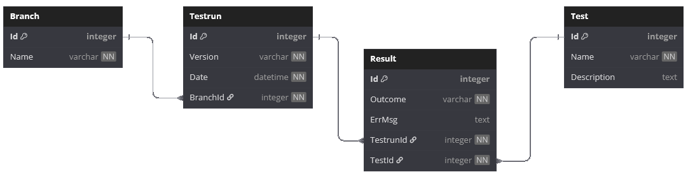

# TestRes-Tracker
Web-based backend service for uploading test run results from various file formats into a database, and accessing structured data via REST API.  
The architecture is easily adaptable for integration into any QA department workflow.

Currently, microservices communicate with each other via Redis pub/sub and HTTP.

### Build statuses
  
  


## Architecture



## Projects
- **TrtUploadService** - Receives test result files via POST, saves them to storage, triggers parsing, and then pushes results to the DB via ApiService.
- **TrtParserService** - Parses the saved file according to its extension and returns a DTO.
- **TrtApiService** - Handles DB logic and provides CRUD operations for easy navigation and storage.
- **TrtShared** - Shared code and DTOs for all microservices.
  
## Quick Start
1. **Clone the repository**  
   `git clone https://github.com/trippymajo/TestRes-Tracker.git`

2. **Configure environment variables:**  
   - Copy `.env.template` to `.env` and fill in your values (Redis, PostgreSQL).
   - Edit/Create `appsettings.json` files in each project as described in the corresponding README files.

3. **Start the stack:**  
   - Run `docker compose up` (using `compose.yaml`)  
   - This will start all required containers (Redis, PostgreSQL) for local development.

4. **Create DB migrations**
   - Terminal:
   ```bash
   cd TrTracker\TrtApiService
   dotnet ef migrations add InitialCreate --project TrtApiService --startup-project TrtApiService
   dotnet ef database update --project TrtApiService --startup-project TrtApiService
   ```
   or use my migrations:
   ```bash
   cd TrTracker\TrtApiService
   dotnet ef database update
   ```

5. **Start the system**
   - MS VS:  
    Use 'ALL' configuration to build and start all the microservices. F5 or Ctrl+F5 without debugging.
   - Terminal:
   ```bash
   dotnet restore
   dotnet build
   # In separate terminal windows/tabs, run:
   dotnet run --project ./TrTracker/TrtApiService/TrtApiService.csproj
   dotnet run --project ./TrTracker/TrtParserService/TrtParserService.csproj
   dotnet run --project ./TrTracker/TrtUploadService/TrtUploadService.csproj
   ```

## Roadmap
- [x] GitHub Actions CI for all projects
- [ ] Api Service CRUD
- [ ] Full cloud deployment
- [ ] Security research
- [ ] More test results formats support

## Contributing
Pull requests, additional info in issues are welcome! But currently nothing related to ApiService, as it is not ready yet.
Help needed with:  
- [ ] Parsers of the test files
- [ ] Concrete implementations for Azure Cloud Development
- [ ] Concrete implementations for Google Cloud Development
