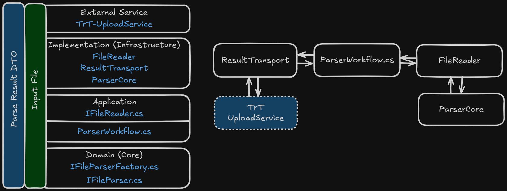

# TrtParserService


### Configuring appsettings.json
  
```json
{
  "ParserService": {
    "StorageProvider": "Local"
  },
  "Logging": {
    "LogLevel": {
      "Default": "Information",
      "Microsoft.Hosting.Lifetime": "Information"
    }
  },
  "Redis": {
    "Host": "localhost",
    "Port": 6379,
    "Password": "localpassword123",
    "UseSsl": false
  }
}
```
  
## ParserService
StorageProvider:
* Local - store files on local machine in temporary directory as Path.GetTempPath() defined
* S3Aws - upload files to AWS S3, using additional configuration from the S3Aws section
  
```json
"S3Aws": {
  "BucketName": "your-bucket",
  "Region": "il-central-1",
}
```
  
* BucketName - created bucket ready for uploading files into it in your AWS S3
* Region - AWS region information used to lazily compute the service endpoints. Info:[AWS doc](https://docs.aws.amazon.com/general/latest/gr/rande.html)
  
## Redis
* Host - hostname of the redis service
* Port - opened port for redis transfering
* Password - password for secure redis pub/sub
* UseSsl - More secure channel, [true] by default. For local non pruduction deployment use [false]

